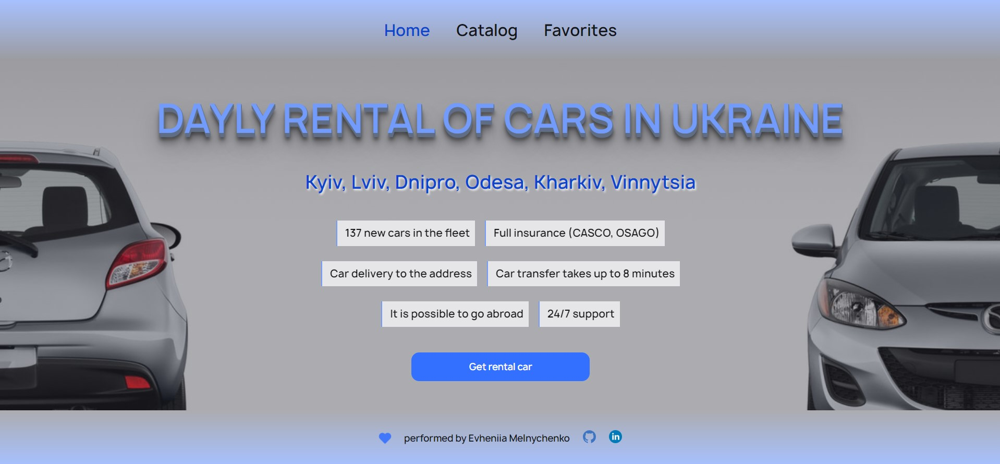

# Car Rental Application

This is a simple car rental application developed as a test project.

## Overview

The application consists of three main pages:

1. Home Page: Provides a general overview of the services offered by the company.

 
 
2. Catalog Page: Displays a catalog of cars with various characteristics that users can filter by brand, hourly rental price, and mileage.

  
3. Favorites Page: Shows advertisements added by the user to their favorites list.

## Functionality

- Viewing and filtering car advertisements by brand, hourly rental price, and mileage.
- Adding and removing advertisements from the favorites list.

- Viewing detailed information about a car and its rental conditions in a modal window.

- Contacting the car rental company through the "Rent a Car" button with a link to the phone number +380730000000.

## Technical Requirements

- The application is developed using React.
- Routing is implemented using React Router.
- Car advertisement data is fetched from a dedicated server created on MockAPI.
- The appearance and style of the interface are developed according to your preferences.
- Pagination is implemented on the Catalog page, with 8 advertisements per page.
- User actions are preserved even after refreshing the page.

## Additional Features

- Filtering:
  - Dropdown list to choose the car brand.
  - Dropdown list to choose hourly rental prices with a $10 increment.
  - Input fields to define the mileage range.

## Authors

- Created by Melnychenko Yevheniya ❤️
- Car images sourced from [source](https://cloudinary.com/)
- MockAPI is used to provide car data
