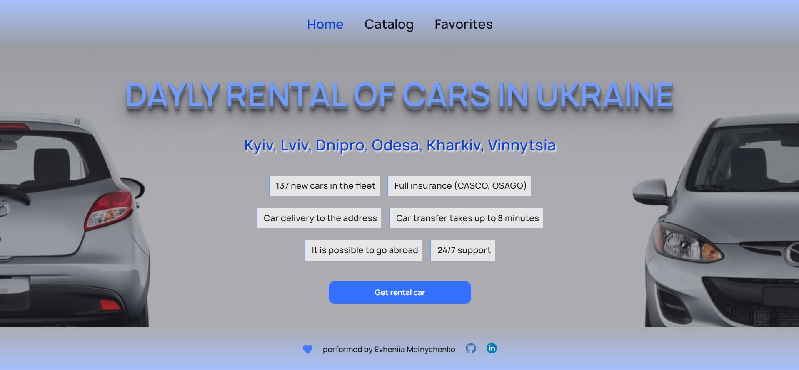
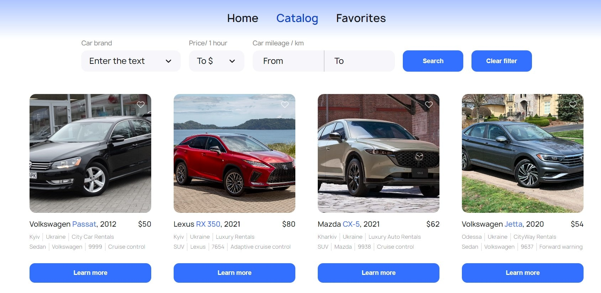
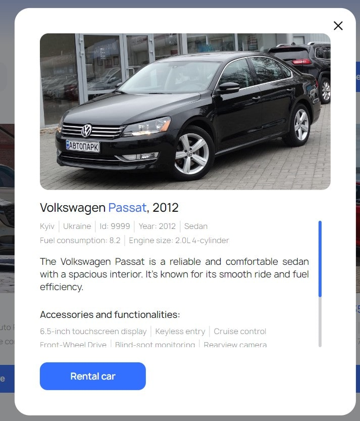

# Додаток для Оренди Автомобілів

Це простий додаток для оренди автомобілів, розроблений як тестовий проект.

## Огляд

Додаток складається з трьох основних сторінок:

1. Домашня сторінка: Надає загальний огляд послуг, які надає компанія.

 
 
2. Сторінка Каталогу: Відображає каталог автомобілів з різними характеристиками, які користувач може фільтрувати за маркою, годинною орендною ціною та пробігом.

  
3. Сторінка Улюблені: Показує оголошення, додані користувачем до свого списку улюблених.

## Функціональність

- Перегляд та фільтрація оголошень про автомобілі за брендом, годинною орендною ціною та пробігом.
- Додавання та видалення оголошень зі списку улюблених.

- Перегляд детальної інформації про авто та умови його оренди в модальному вікні.

- Зв'язок з компанією з оренди авто через кнопку "Орендувати авто" із посиланням на номер телефону +380730000000.

## Технічні Вимоги

- Додаток розроблено на базі React.
- Маршрутизація реалізована за допомогою React Router.
- Дані про оголошення про автомобілі запитуються зі спеціального серверу, створеного на MockAPI.
- Вигляд і стиль інтерфейсу розроблено відповідно до ваших уподобань.
- Реалізована пагінація на сторінці Каталогу, з 8 оголошеннями на сторінку.
- Дії користувача зберігаються навіть після оновлення сторінки.

## Додаткові Особливості

- Фільтрація:
  - Випадаючий список для вибору марки автомобіля.
  - Випадаючий список для вибору годинних цін оренди з кроком у $10.
  - Поля введення для визначення діапазону пробігу.

## Автори

- Створено Мельниченко Євгенією ❤️
- Зображення авто взято з [джерела](https://cloudinary.com/)
- MockAPI використовується для надання даних про автомобілі
